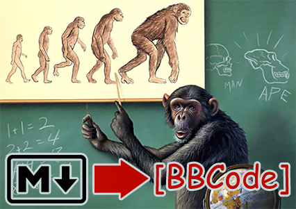

# md2bbcode.py
## Convert Markdown to BBCode
The main script. Converts github-flavor Markdown to Xenforo/RedGuides-flavor BBCode.

```plaintext
usage: md2bbcode.py [-h] [--domain DOMAIN] [--debug] input

Convert Markdown file to BBCode with HTML processing.

positional arguments:
  input            Input Markdown file path

options:
  -h, --help       show this help message and exit
  --domain DOMAIN  Domain to prepend to relative URLs
  --debug          Output intermediate results to files for debugging
```

# html2bbcode.py
## Converts HTML tags to BBCode
Converts HTML tags to BBCode, since those are sometimes used in markdown. It's not ideal, see a better solution in the file comments.

```plaintext
usage: html2bbcode.py [-h] [--debug] input_file

Convert HTML to BBCode with optional debugging output.

positional arguments:
  input_file  Input HTML file path

options:
  -h, --help  show this help message and exit
  --debug     Save output to readme.finalpass for debugging
```

# md2ast.py
## For debugging Mistune's renderer
```plaintext
usage: md2ast.py [-h] input output

Convert Markdown file to AST file (JSON format).

positional arguments:
  input       Input Markdown file path
  output      Output AST file path (JSON format)

options:
  -h, --help  show this help message and exit
```

# renderers/bbcode.py
## BBCode Renderer for [Mistune v3.0.2](https://github.com/lepture/mistune/releases/tag/v3.0.2)

Custom renderer for Mistune

### Usage
Placed in a `/renderers` subfolder of your project,

```python 
import mistune
from renderers.bbcode import BBCodeRenderer

mistune.create_markdown(renderer=BBCodeRenderer(domain='https://raw.githubusercontent.com/user/repo/branch'))
```